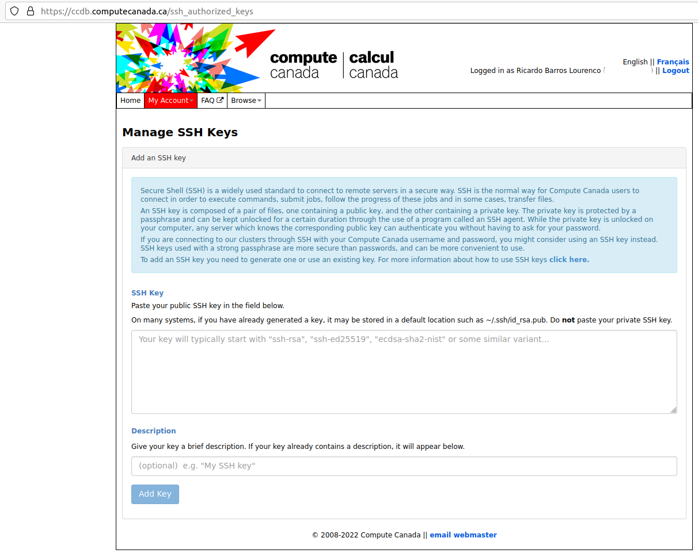

# Compute Canada
*Note*: This section is under heavy work. For now, please refer to Compute 
Canada's [Wiki](https://docs.computecanada.ca/wiki/Compute_Canada_Documentation).

### Setting up SSH on Compute Canada portal
From January 2022 forward, Compute Canada is enforcing that is mandatory to use 
a key to use SSH with their premises (ex.: accessing login nodes). For this, you 
need to create a public-private SSH key, and _drop_ the public key at the 
Compute Canada user portal, under your account settings.

#### Creating a SSH key
Some description of this is found at the Compute Canada documentation @CC_ssh_key . 
Is good practice to read it, since it covers some specifics.

To create a SSH key you need to use _ssh-keygen_. On windows, you can access it 
through [PowerShell](https://docs.microsoft.com/en-us/windows-server/administration/openssh/openssh_keymanagement#user-key-generation), on MacOS using Terminal, and on any Linux 
distribution via a shell terminal (such as Bash, for example).

In a general way, you can create a new key pair with this command:

```{bash, eval=FALSE}
$ ssh-keygen -C 'compute canada systems' -f computecanada-key -t rsa -b 4096
```

The parameters refer to:

- _-C_: A label for the key being generated, useful when you have multiple SSH 
keys in a machine;
- _-f_: The name of the key file. Once run, ssh-keygen will output a file with 
such name without extension which is the _private-key_, and another file, with a 
same name, but with extension _*.pub_, corresponding to the _public-key_.
- _-t_: Represents the choice of encrypting scheme, which on this case is a RSA 
one, with _4096_ bits as the key size.

Once you hit the command, you should have on the folder you are running these two files:
- _computecanada-key_ (without file extension): corresponds to the private key;
- _computecanada-key.pub_: corresponds to the public key.

*WARNING*: The private key is equal to a regular password to the system you are using it to access. Therefore, it is recommended that you assign a key password 
(it will be requested when you are generating the key), to assure that if such key is lost/copied/etc, nobody would be able to access this system impersonating you. A series of good practices for ssh keys may be found at this [post](https://security.stackexchange.com/a/144044/275095).

### Depositing the public key on Compute Canada
Once created the key pair, you need to deposit the *public key* on your Compute 
Canada account. A main tutorial is provided [here](https://docs.computecanada.ca/wiki/SSH_Keys) 
but you can proceed as follows:

- [Login](https://ccdb.computecanada.ca/) at your Compute Canada account, you should see a screen as such:
```{r figure1, echo=FALSE, fig.cap="Landing page of your Compute Canada account", out.width = '100%'}
knitr::include_graphics("images/cc_accnt_01.png")
```

- Enter in the _My Account_ tab, then click _Manage SSH Keys_:
```{r figure2, echo=FALSE, fig.cap="Manage SSH Keys menu", out.width = '100%'}
knitr::include_graphics("images/cc_accnt_02.png")
```

- Then you should have the SSH Key management options:
```{r figure3, echo=FALSE, fig.cap="SSH Key Management options", out.width = '100%'}

```

- Now insert the content of your SSH *public key* in the first field. 
To do so, you need to open your _*.pub_ file with a simple text editor (ex.: Notepad on Windows, TextEdit on MacOS, Gedit/Vi/Emacs on Linux - Do not open with text processing software, as MS Word!) select all content and copy-paste into the first text box.

- Then you should assign a _Description_ to such key. I recommend that you use different keys for every system you use to connect to Compute Canada Systems, and this field should reflect each of these systems. For example, a description as such _Desktop Machine at the Laboratory", or "Personal Notebook" would be enough to identify where these keys lie (especially important if you get hacked and someone steals your key).

- Then hit _Add Key_. This operation will put your public key on every machine of Compute Canada, and may take up to 30 minutes to be online.

### Accessing a Compute Canada _login node_
Once your public key is loaded and synchronized in all machines, you may login a compute node using a terminal (On Windows, you need to use PowerShell; on MacOS, Terminal; and on Linux, your preferred Shell, such as Bash):

```{bash, eval=FALSE}
$ ssh -i ./computecanada-key your-compute-canada-username@MMMMMM.computecanada.ca
```

The command opens a SSH terminal session with the following parameters:

- _-i_ : The path and the name of your *Private Key*;
- _your-compute-canada-username_ : The username you have set for your Compute Canada account, when registering with them for an account;
- _MMMMMM_ : One of the Compute Canada clusters (for example, Cedar, Graham, or Beluga)

*Note*: We will provide a more extensive list of computing environments later, but for now you may want to refer to [this presentation](http://bit.ly/introhpc).


<!-- # Job Scheduling -->

<!-- ## Slurm  -->

<!-- ### Basic Commands -->

### Running batch jobs
If you want to run a R-language batch job, please take a look on the 
[CCrecipes repository](https://github.com/ricardobarroslourenco/CCrecipes). 

More specifically at the `slurm/R/r_batch_standalone.sh` file, we have:

```{bash, eval=FALSE}
#!/bin/bash

### Sets shell for parallel program (no distribution - no MPI)
### Inspired by the current documentation available on CC Wiki.

#SBATCH --account=def-someacct             # replace this with your PI account
#SBATCH --nodes=1                          # number of node MUST be 1
#SBATCH --cpus-per-task=4                  # number of processes
#SBATCH --mem-per-cpu=2048M                # memory; default unit is megabytes
#SBATCH --time=0-00:15                     # time (DD-HH:MM)
#SBATCH --mail-user=yourname@someplace.com # Send email updates to you or someone else
#SBATCH --mail-type=ALL                    # send an email in all cases (job started, job ended, job aborted)

### Load library modules
module load gcc/9.3.0 r/4.0.2

### Load r-packages (builds locally) - comment, if unecessary to install new libraries
#R install_script.R

### Export locally installed packages
# TODO: check if this path holds
export R_LIBS=~/local/R_libs/

### Run main_job.R - or any batch script necessary
R CMD BATCH --no-save --no-restore ~/main_job.R
```

Some requirements:

- The R file `main_job.R` needs to be at the root of your user folder. 
- Also the script needs to be executable (command runned at the same folder 
as `r_batch_standalone.sh`:

```{bash, eval=FALSE}
$ chmod +x r_batch_standalone.sh
```

- Finally, you can submit this batch job as:
```{bash, eval=FALSE}
$ sbatch r_batch_standalone.sh
```

Once submitted, you should receive a job number at the console. Once its status
change at the scheduler (job started, job ended, job aborted), you should receive
an e-mail. 

If getting into running issues, take a look on the errors by inspecting the 
output files which will be saved at the same folder you submitted the job and 
have the name `slurm-xxxxxx.out` in which `xxxxxx` is the job number.


<!-- ### Running interactive jobs -->