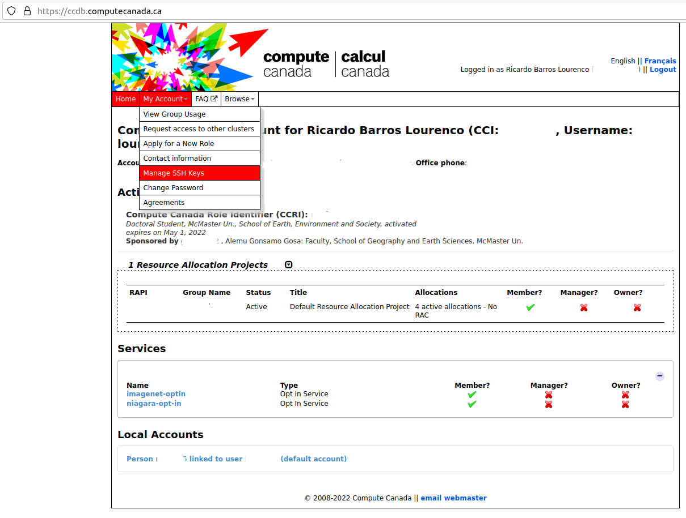
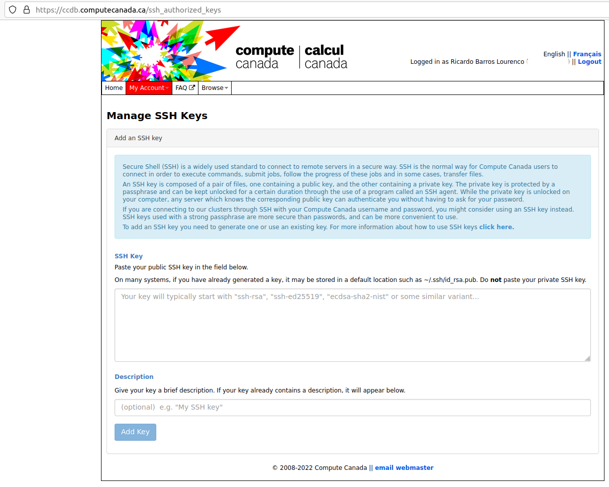

--- 
title: 'CC Primer: Compute Canada for geoscientists in a rush'
author: "Ricardo Barros Lourenco"
date: 'Last revision: `r Sys.Date()`'
site: bookdown::bookdown_site
documentclass: book
bibliography:
- book.bib
- packages.bib
csl: ieee.csl
url: https://ricardobarroslourenco.github.io/CCprimer/
description: |
  Descricao (campo)
link-citations: yes
github-repo: ricardobarroslourenco/CCprimer
---

# Front Matter

## Copyright

Otherwise stated in the text, this content is licensed under a [Creative Commons Attribution-NonCommercial-ShareAlike 4.0 International License](http://creativecommons.org/licenses/by-nc-sa/4.0/).

### How to cite this work
Please use this BibTeX fragment:

```{r, eval=FALSE}
@book{BarrosLourenco2022,
  title     = "CC Primer: Compute Canada for geoscientists in a rush",
  author    = "Barros Lourenco, Ricardo",
  year      = 2022,
  doi       = "10.5281/zenodo.5937906"
  note      = {\url{https://ricardobarroslourenco.github.io/CCprimer/}(visited yyyy-mm-dd)}
}
```

Obs.: Note that the DOI is of a previous version (10.5281/zenodo.5937906) when 
comapred to the badge displayed on this website, because it relates to all versions
of this document, rather than a especific one.

<!-- ## Dedication -->

<!-- ## Epigraph -->
<!-- > "Here's to the crazy ones. -->
<!-- > The misfits. -->
<!-- > The rebels. -->
<!-- > The troublemakers. -->
<!-- > The round pegs in the square holes. -->
<!-- > -->
<!-- > The ones who see things differently. -->
<!-- > -->
<!-- > They're not fond of rules. -->
<!-- > And they have no respect for the status quo. -->
<!-- > -->
<!-- > You can quote them, disagree with them, glorify or vilify them. -->
<!-- > About the only thing you can't do is ignore them. -->
<!-- > -->
<!-- > Because they change things. -->
<!-- > -->
<!-- > They push the human race forward. -->
<!-- > -->
<!-- > While some may see them as the crazy ones, -->
<!-- we see genius. -->
<!-- > -->
<!-- > Because the people who are crazy enough to think -->
<!-- they can change the world, are the ones who do." -->
<!-- > -->
<!-- > --- Apple Computer, _"Think different"_ campaign. TBWA-Chiat-Day. -->


<!-- ## Foreword -->

<!-- ## Preface -->

<!-- ## Acknowledgements -->

<!-- ## List of abbreviations and acronyms -->

## Cronology
2023-06-07 - v0.3 - Adds Jupyter description, and BASH screen tool usage

2023-05-23 - v0.2 - Adds description on how to run Rstudio Server on Alliance 
Canada Premises.

2022-01-31 - Beginning of v0.1. (This version is quite unstable, and versioning 
during this stage will be limited).

<!-- --- Supressed from the template --- -->
<!-- ## Usage  -->

<!-- Each **bookdown** chapter is an .Rmd file, and each .Rmd file can contain one (and only one) chapter. A chapter *must* start with a first-level heading: `# A good chapter`, and can contain one (and only one) first-level heading. -->

<!-- Use second-level and higher headings within chapters like: `## A short section` or `### An even shorter section`. -->

<!-- The `index.Rmd` file is required, and is also your first book chapter. It will be the homepage when you render the book. -->

<!-- ## Render book -->

<!-- You can render the HTML version of this example book without changing anything: -->

<!-- 1. Find the **Build** pane in the RStudio IDE, and -->

<!-- 1. Click on **Build Book**, then select your output format, or select "All formats" if you'd like to use multiple formats from the same book source files. -->

<!-- Or build the book from the R console: -->

<!-- ```{r, eval=FALSE} -->
<!-- bookdown::render_book() -->
<!-- ``` -->

<!-- To render this example to PDF as a `bookdown::pdf_book`, you'll need to install XeLaTeX. You are recommended to install TinyTeX (which includes XeLaTeX): <https://yihui.org/tinytex/>. -->

<!-- ## Preview book -->

<!-- As you work, you may start a local server to live preview this HTML book. This preview will update as you edit the book when you save individual .Rmd files. You can start the server in a work session by using the RStudio add-in "Preview book", or from the R console: -->

<!-- # ```{r eval=FALSE} -->
<!-- # bookdown::serve_book() -->
<!-- # ``` -->


<!--chapter:end:index.Rmd-->

# Version Control Systems
*Version Control Systems* @wiki_version_control (VCS - also named as _Revision Control_, 
_Source Code Control_, _Source Code Management_) are Computer Systems 
traditionally used to manage the complexities of software development, majorly 
Computer Systems involving multiple software modules, and large development teams.

Such systems help to organize such development, especially when collaboration of
multiple developers is done, and several times people are doing code changes in 
a same, or close, part of the code, which may break it, or even generate 
unexpected results that would not be traceable.

<!-- ## Why using it (out of CS)? -->
<!-- Science is becoming more collaborative everyday, with groups of people contributing within a  -->
<!-- same research group, across groups and across institutions. At the same time, efforts on Open Science, and Reproducible Science are demanded by the scientific community as a way to measure progress in transparent and objective criteria, as well as providing accountability on such developments. Since  -->
<!-- the interactions between academics and industries are becoming more frequent, scientists are also called -->
<!-- to bring a same accountability level as if they were stakeholders of such companies. -->

<!-- Given this scenario, CVS systems are often used in a way to provide towards the scientific method (when using computational resources): -->

<!-- - Open Science -->
<!-- -- Open data:  -->
<!-- -- Open source-code: -->
<!-- -- Open access: -->
<!-- -- Open peer-review: -->
<!-- -- Open educational resources: -->
<!-- - FAIR data -->
<!-- -- Data is Findable: -->
<!-- -- Data is accessible: -->
<!-- -- Data (and code) are interoperable: -->
<!-- -- Data (and experiments) are reusable: -->
<!-- - Reproducible experiments:  -->

## VCS: Local repository vs. Remote repository
Common VCS's (ex.: [CVS](https://en.wikipedia.org/wiki/Concurrent_Versions_System), 
[SVN](https://en.wikipedia.org/wiki/Concurrent_Versions_System) and
[Git](https://en.wikipedia.org/wiki/Git)) always are client-server systems.

The VCS client is not merely a means to access a central repository hosted 
at the VCS server, but actually is part of running checks and balances that are 
necessary when adding code to the central repository. A situation that demands that
is when multiple users are doing a change in a same piece of code, and checking 
it only at the central repository may complicate more a situation already 
complicated (simultaneous contribution). Therefore, it hosts, locally 
a local copy of the codebase, which reflects a view of that codebase in time 
(more preciselly when that local user retrieved a copy from the central repository 
for editing).

Once the changes are done, the user saves a local copy of these at the local repository, 
and if these meet the criteria for changes (and this may vary a lot among systems), 
the user is able to persist this change at the local repository, as a new version of 
the codebase. This process is known as _commit_ (in this case, a local one).


## Git
[Git](https://git-scm.com/) is a contemporary VCS that is used as the backbone 
of operations run on GitHub. So, when planning to operate with GitHub, it is 
almost certain that you will need to install a Git client on your machine. 

We can say _almost_ because GitHub provides an own client, 
[GitHub Desktop](https://desktop.github.com/) which provides a Graphical User 
Interface(GUI) to a git client. 

We will not cover such GUI usage since on Compute Canada you will not have access 
to GitHub Desktop on their machines, but only to 
a regular Git client (that you can use to access either GitHub, or another Git 
compliant server such as a private repository built with 
[GitLab](https://about.gitlab.com/)).

### Installing a git client on your machine

#### Ubuntu (or any other Debian-based environment)
First update your Operating System (OS) repository indexes:
```{bash, eval=FALSE}
sudo apt-get update
```

Then proceed to install:
```{bash, eval=FALSE}
sudo apt-get install git
```

Note: If you use Ubuntu, git is already provided as a base repository on this 
distribution. If you use another linux, and this does not work for you, please 
[open an issue](https://github.com/ricardobarroslourenco/CCprimer/issues) on 
this project and use the label _requests_, and I will try to solve and include 
here for future reference.

#### Apple
Apple is an OS that not use repositories by default, and git is not provided in 
the main set of software. So you would have three main options to install git:

- Install Xcode (*Preferred*): Apple has a software development kit (SDK) named 
[XCode](https://developer.apple.com/xcode/) which provides git among several other
software for MacOS and iOS software development. The advantage of using XCode´s 
git distribution is that it comes adjusted for your OS and is supported by Apple,
whcih avoids conflicts and security issues.
  - To install XCode (and git by consequence), open the App Store, and search 
  XCode as a software developed by Apple, and install it. To test, open the 
  Terminal App, and run _git_. You should receive an output of basic 
description of commands available on git.
- Install Homebrew, and then install Git (if you are a Homebrew user, or uses a 
lot of *.nix software not supported by Apple it is useful): 
  - [Download and install homebrew](https://brew.sh/) from their website;
  - Install git as:
  ```{bash, eval=FALSE}
  brew install git
  ```
  - In the terminal, run _git_ and you should receive an output of basic 
description of commands available on git.
- Install a standalone version of git (*not recommended*): You can download and 
install from git´s website a standalone client (I will not be covering this 
approach, because git will not be updated via this kind a install, posing a 
security risk and install this at your own risk - and effort!)

#### Windows
Since Windows works with standalone installations, the install follows as this:

- Go to the Git website and [download](https://git-scm.com/download/win) the 
latest client (download the standalone version, unless you have severe storage 
limitations on your machine);
- Once downloaded, run the installer with admin permissions and follow the 
default installation;
- When installed, open PowerShell (PS) (or the command prompt, if you do not 
have PS installed), and run _git_ and hit enter. You should receive an output of basic 
description of commands available on git.

### Setting up your local git client
Once you have your git client up and running, you need to setup the access 
credentials to connect to a git repository, such as GitHub or GitLab for example.

To do so, run on your bash terminal (or command-line if on windows):
```{bash, eval=FALSE}
git config -- global user.name "Your full name"
```
Note: On quotes you need to specify a name (depending on the environment, 
it should be your full name, or an alias, such as employee number, for example). This 
command has a global scope, so all users on your machine would have the same setup.

Then you need to specify an e-mail address (if on GitHub, it is preferred that 
is linked to your account):
```{bash, eval=FALSE}
git config -- global user.email "Your e-mail address"
```

Then check, if all values were set:
```{bash, eval=FALSE}
git config --list
```
You should see an output that reflects those previously set name and e-mail values.

<!-- https://docs.github.com/pt/get-started/getting-started-with-git/setting-your-username-in-git -->
<!-- https://www.edgoad.com/2021/02/using-personal-access-tokens-with-git-and-github.html -->

## GitHub
<!-- GitHub is a web.... --- Describe -->
GitHub is a Web collaborative Version Control service based on a Git platform. It was
created in 2008, and as of today is the largest repository of source code in the World.
Aside of VCS capabilities, it provides other computational services, such as 
Continuous Integration (CI) and Continuous Deployment (CD), Web Page Hosting on GitHub 
Pages, security solutions, a software marketplace, among many others. It was recently 
acquired by Microsoft, as one of the largest transactions in the tech domain.

GitHub has several different [tiers of access](https://docs.github.com/en/get-started/learning-about-github/githubs-products#about-githubs-products), 
from basic free accounts up to corporate ones.

A main advantage for academic users would be using the [GitHub Education](https://education.github.com) which includes a free [GitHub PRO](https://docs.github.com/en/get-started/learning-about-github/githubs-products#github-pro) 
account and several software for free (or services credit hours) while you are 
enrolled in an academic institution. GitHub Education also have [different tiers of users](https://education.github.com/benefits) 
aiming students, teachers, and the academic institutions itselves. Once you 
create a simple free GitHub account, you can return back to GitHub Education, 
and request to be enrolled in the program.

### Creating an account
To create an account is simple:

- Go to [GitHub pricing page](https://github.com/pricing), select the Free tier, 
and click _Join for Free_;
- Just follow the prompts to create your personal account.
- You should receive an e-mail from them on the registered e-mail account, to 
verify your identity. If you fail to do so, your account would be basically [useless](https://docs.github.com/en/get-started/signing-up-for-github/verifying-your-email-address#about-email-verification). 
 
Note: Since I have created my account some years ago, I am just using GitHub's
user documentation as reference. If things get complicated in this step, please 
let me know, and I will expand here.

### Insert GitHub credentials on your local Git
Once you have your GitHub account created, and verified, it is time to setup these
credentials on your local Git client. While logged on your GitHub account you should:

* Click on your _name/avatar/photo at the upper right corner of the screen_, and 
then click on _Settings_; 
* Then click on _Developer Settings_ (it is the last item on the bottom of 
items at the left panel);
* Now click on the bottom item, _Personal access tokens_;
* Then, click on _Generate new token_, you will be requested again for your 
password on this step;
* Now you will be required to fill in some info:
  + _Note_: This will be a name of this Token. I often create a Token per 
  software+device I use, then someone can write "Rstudio on Laptop", to 
  differentiate from "Rstudio on laboratory desktop". 
    - Isolating tokens on different (software,device) pairs helps isolating 
    accesses to your GitHub account, and is important to contain a security 
    breach. If someone is able to fetch one of your tokens, you will know from 
    which machine and which software on it came from.
  + _Expiration_: You should define a expiration date for your token. Choosing 
  a date is an open ended question, but ideally systems exposed to the Web, or 
  multiple users such an HPC cluster, should be changed frequently. 
    - _Avoid at all means to use the No expiration_ mode, because you never 
    want to forget unattended keys of your GitHub (ex. You graduate, and your 
    key is left on a machine that another student will use in the lab).
  + _Select scopes_: Perhaps this is the trickiest setup. The definition of a 
  Token is actually a definition of a [OAuth](https://en.wikipedia.org/wiki/OAuth) 
  Token. On GitHub, this implies on being able to select all options that a user 
  has in terms of operations on the platform, and actually, narrowing down to 
  what a user wants to grant permission for in such Token. 
    - Note: It is tempting to grant _all permissions_ to a single Token, but the user 
    should ask it that is really necessary. In one end, granting all permissions 
    is too permissive, and being as problematic as having a token with no 
    expiration data. 
    - To look into what each scope covers, please look into this 
    [page](https://docs.github.com/en/developers/apps/building-oauth-apps/scopes-for-oauth-apps#available-scopes).
* Once you have generated your token, treat is as a password (even in terms of 
security/sharing/etc.). You should not persist a copy of it, but only use for your 
local git setup. Even if you loose access to it, you can always revoke that 
token, and create a new one.
* To set your local git to access GitHub (remind that you need first to set [global variables](https://ricardobarroslourenco.github.io/CCprimer/version-control-systems.html#setting-up-your-local-git-client)),
you just need to access GitHub with it. A simple way, that will be further 
explained in more detail would be making a local copy of a repository using _git clone_:
```{bash, eval=FALSE}
git clone https://github.com/a_very_weird_user_name/a_more_weird_user_project_name.git
```
A concrete example would be the source-code of this document:
```{bash, eval=FALSE}
git clone https://github.com/ricardobarroslourenco/CCprimer.git
```
* Once done, your local git should request:
  + User-name: The one you have set for your GitHub account;
  + Password: Your token.
* After this, it should make a local copy of that cloned repository (more 
especifically this copy will be stored at the directory path you have run the 
clone command - in bash / terminal / command line).
  + Note: If you have not been requested a username/password, maybe you have already
  a GitHub account already set on your machine (so please note if any errors occur 
  when trying to access GitHub with git, no username + password is required - 
  if these occur, they will be output on your bash / terminal / command line)
* Finally, to persist the token on your local install, run:
```{bash, eval=FALSE}
git config --global credential.helper cache
```
  + If you need to clean-up the token(s) installed:
  ```{bash, eval=FALSE}
  $ git config --global --unset credential.helper
  ```
<!-- https://www.edgoad.com/2021/02/using-personal-access-tokens-with-git-and-github.html -->

## A combined usage of Git-GitHub
This section describes a usage of Git-GitHub intended for scientific usage. Therefore, 
is important to remark that there is still no consolidated practice on such application, 
considering that these tools were not meant for academic usage, but rather for a software
 engineering one. Such application varies across research groups and scientific domains, and on a best effort, we will summarize some good practices and update as needed.
 
### Basic commands to update a repository
After cloning a public repository, a user may want to update it in several ways. 
A very common HPC scenario is when the user is testing code in production, 
in a cluster environment, while debugging. Other scenarios are related to persist 
small data outputs - considering the repository storage limitations.

Given that, users should do, once saved their changes to the local git is to 
_add_, _commit_ and then _push_ changes.

#### Git Add
When the user create or delete file(s) it is necessary to inform `git` that such 
addition/deletion happened via:

```{bash, eval=FALSE}
git add folder_url
```

If you want to update the entire project, you need to go via bash to the root of
the git project, and then:

```{bash, eval=FALSE}
git add .
```

#### Git commit
After eventual addition/deletion(s) are informed to git, then, it is necessary 
to inform updates and the nature of these. This can be done via:

```{bash, eval=FALSE}
git commit -m "message describing the commit"
```

Ideally the message would describe what was done. Important to note that this 
could be done multiple times, because this is only persisting local changes (on 
the machine which the client is installed), not global changes. It is good practice 
to group "same topic" commits, as it is easier to do a rollback of such changes, 
avoiding to impact changes not related to a found issue.

#### Git push
Once the local repository changes are finalized, the user needs to synchronize 
these local changes with the main git(like)/GitHub repository. Only after this, 
these changes would become available to all users.

Often the repository on github has a `main` branch, therefore, the command is:

```{bash, eval=FALSE}
git push -u origin main
```

In which `origin` is the local repository, and `main` is the branch you want to 
update in the git server. These may be different, depending on your project 
characteristics.
<!-- ### Creating a repository -->
<!-- A _repository_ is a collection of code, stored on a git server (in this case,  -->
<!-- a GitHub Repository). As any intellectual task, you may split your information/code -->
<!--  as desired.  -->

<!-- In CS, people often keep a same service (a part of a system) at a  -->
<!-- same repository.  -->

<!-- In academia, is a consensus that researchers tend to keep all the codebase used  -->
<!-- in a publication at a same repository. Then some variation occurs across communities. -->
<!-- The GIScience community, more especifically the R GIScience community, developed a  -->

<!-- Depending on how you set your environment, there are some options to crea -->
<!-- <!-- https://www.atlassian.com/git/tutorials/setting-up-a-repository/git-init --> 

<!-- ### Retrieving code from a repository -->
<!-- <!-- https://www.atlassian.com/git/tutorials/setting-up-a-repository/git-clone --> 
<!-- <!-- https://www.atlassian.com/git/tutorials/syncing/git-pull --> 

<!-- ### Submitting code to a repository -->
<!-- <!-- https://www.atlassian.com/git/tutorials/saving-changes/git-commit -->  
<!-- <!-- https://www.atlassian.com/git/tutorials/syncing/git-push --> 

<!-- ### Conciliating _"conflicts"_ -->
<!-- #### Git Merge -->
<!-- <!-- https://www.atlassian.com/git/tutorials/using-branches/git-merge --> 
<!-- #### Git Rebase -->
<!-- <!-- https://www.atlassian.com/git/tutorials/rewriting-history/git-rebase --> 

<!-- ### Contributing to open-source projects -->
<!-- #### Creating a pull request -->
<!-- <!-- https://docs.github.com/en/pull-requests/collaborating-with-pull-requests/proposing-changes-to-your-work-with-pull-requests/about-pull-requests --> 

<!--chapter:end:01-vc.Rmd-->

# Compute Canada
*Note*: This section is under heavy work. For now, please refer to Compute 
Canada's [Wiki](https://docs.computecanada.ca/wiki/Compute_Canada_Documentation).

### Setting up SSH on Compute Canada portal
From January 2022 forward, Compute Canada is enforcing that is mandatory to use 
a key to use SSH with their premises (ex.: accessing login nodes). For this, you 
need to create a public-private SSH key, and _drop_ the public key at the 
Compute Canada user portal, under your account settings.

#### Creating a SSH key
Some description of this is found at the Compute Canada documentation @CC_ssh_key . 
Is good practice to read it, since it covers some specifics.

To create a SSH key you need to use _ssh-keygen_. On windows, you can access it 
through [PowerShell](https://docs.microsoft.com/en-us/windows-server/administration/openssh/openssh_keymanagement#user-key-generation), on MacOS using Terminal, and on any Linux 
distribution via a shell terminal (such as Bash, for example).

In a general way, you can create a new key pair with this command:

```{bash, eval=FALSE}
ssh-keygen -C 'compute canada systems' -f computecanada-key -t rsa -b 4096
```

The parameters refer to:

- _-C_: A label for the key being generated, useful when you have multiple SSH 
keys in a machine;
- _-f_: The name of the key file. Once run, ssh-keygen will output a file with 
such name without extension which is the _private-key_, and another file, with a 
same name, but with extension _*.pub_, corresponding to the _public-key_.
- _-t_: Represents the choice of encrypting scheme, which on this case is a RSA 
one, with _4096_ bits as the key size.

Once you hit the command, you should have on the folder you are running these two files:
- _computecanada-key_ (without file extension): corresponds to the private key;
- _computecanada-key.pub_: corresponds to the public key.

*WARNING*: The private key is equal to a regular password to the system you are using it to access. Therefore, it is recommended that you assign a key password 
(it will be requested when you are generating the key), to assure that if such key is lost/copied/etc, nobody would be able to access this system impersonating you. A series of good practices for ssh keys may be found at this [post](https://security.stackexchange.com/a/144044/275095).

### Depositing the public key on Compute Canada
Once created the key pair, you need to deposit the *public key* on your Compute 
Canada account. A main tutorial is provided [here](https://docs.computecanada.ca/wiki/SSH_Keys) 
but you can proceed as follows:

- [Login](https://ccdb.computecanada.ca/) at your Compute Canada account, you should see a screen as such:
```{r figure1, echo=FALSE, fig.cap="Landing page of your Compute Canada account", out.width = '100%'}

```

- Enter in the _My Account_ tab, then click _Manage SSH Keys_:
```{r figure2, echo=FALSE, fig.cap="Manage SSH Keys menu", out.width = '100%'}

```

- Then you should have the SSH Key management options:
```{r figure3, echo=FALSE, fig.cap="SSH Key Management options", out.width = '100%'}

```

- Now insert the content of your SSH *public key* in the first field. 
To do so, you need to open your _.pub_ file with a simple text editor (ex.: Notepad on Windows, TextEdit on MacOS, Gedit/Vi/Emacs on Linux - Do not open with text processing software, as MS Word!) select all content and copy-paste into the first text box.

- Then you should assign a _Description_ to such key. I recommend that you use different keys for every system you use to connect to Compute Canada Systems, and this field should reflect each of these systems. For example, a description as such "_Desktop Machine at the Laboratory_", or "_Personal Laptop_" would be enough to identify where these keys lie (especially important if you get hacked and someone steals your key).

- Then hit _Add Key_. This operation will put your public key on every machine of Compute Canada, and may take up to 30 minutes to be online.

### Accessing a Compute Canada _login node_
Once your public key is loaded and synchronized in all machines, you may login a compute node using a terminal (On Windows, you need to use PowerShell; on MacOS, Terminal; and on Linux, your preferred Shell, such as Bash):

```{bash, eval=FALSE}
ssh -i ./computecanada-key your-compute-canada-username@MMMMMM.computecanada.ca
```

The command opens a SSH terminal session with the following parameters:

- _-i_ : The path and the name of your *Private Key*;
- _your-compute-canada-username_ : The username you have set for your Compute Canada account, when registering with them for an account;
- _MMMMMM_ : One of the Compute Canada clusters (for example, Cedar, Graham, or Beluga)

*Note*: We will provide a more extensive list of computing environments later, but for now you may want to refer to [this presentation](http://bit.ly/introhpc).


<!-- # Job Scheduling -->

<!-- ## Slurm  -->

<!-- ### Basic Commands -->

### Running batch jobs
If you want to run a R-language batch job, please take a look on the 
[CCrecipes repository](https://github.com/ricardobarroslourenco/CCrecipes). 

More specifically at the `slurm/R/r_batch_standalone.sh` file, we have:

```{bash, eval=FALSE}
#!/bin/bash

### Sets shell for parallel program (no distribution - no MPI)
### Inspired by the current documentation available on CC Wiki.

#SBATCH --account=def-someacct             # replace this with your PI account
#SBATCH --nodes=1                          # number of node MUST be 1
#SBATCH --cpus-per-task=4                  # number of processes
#SBATCH --mem-per-cpu=2048M                # memory; default unit is megabytes
#SBATCH --time=0-00:15                     # time (DD-HH:MM)
#SBATCH --mail-user=yourname@someplace.com # Send email updates to you or someone else
#SBATCH --mail-type=ALL                    # send an email in all cases (job started, job ended, job aborted)

### Load library modules
module load gcc/9.3.0 r/4.0.2

### Load r-packages (builds locally) - comment, if unecessary to install new libraries
#R install_script.R

### Export locally installed packages
# TODO: check if this path holds
export R_LIBS=~/local/R_libs/

### Run main_job.R - or any batch script necessary
R CMD BATCH --no-save --no-restore ~/main_job.R
```

Some requirements:

- The R file `main_job.R` needs to be at the root of your user folder. 
- Also the script needs to be executable (command runned at the same folder 
as `r_batch_standalone.sh`:

```{bash, eval=FALSE}
chmod +x r_batch_standalone.sh
```

- Finally, you can submit this batch job as:
```{bash, eval=FALSE}
sbatch r_batch_standalone.sh
```

Once submitted, you should receive a job number at the console. Once its status
change at the scheduler (job started, job ended, job aborted), you should receive
an e-mail. 

If getting into running issues, take a look on the errors by inspecting the 
output files which will be saved at the same folder you submitted the job and 
have the name `slurm-xxxxxx.out` in which `xxxxxx` is the job number.


<!-- ### Running interactive jobs -->

<!--chapter:end:02-CC.Rmd-->

# BASH
On this section we will write some hints on the Bourne Again Shell (BASH), a command interpreter used in several *nix systems, such as Linux, Unix, MacOS and recently incorporated into Windows through PowerShell. This will be more of a collection of hints, and not substituting a full knowledge of BASH and the Operating System in which is running.

## Screen
Screen is a tool you can use to keep a ssh session run through BASH alive. Why it is useful(?):

1. When you have unreliable internet connections connections (ex.: Wifi, cellphone);
2. Power outages;
3. Your local machine freezes, or have any other issue, and your connection is killed;
4. Any random reason that blocks your local terminal to access the remote ssh session.

### How to use it
Some useful description is available in [this website](https://web.archive.org/web/20230606181644/https://www.networkworld.com/article/3441777/how-the-linux-screen-tool-can-save-your-tasks-and-your-sanity-if-ssh-is-interrupted.html), and on the app documentation. But you can proceed as follows:

### Creating a session
You create a new session, named _session_01_ as:

```{bash, eval=FALSE}
screen -S session_01
```

### See all available sessions
```{bash, eval=FALSE}
screen -ls
```

You probably will see something like this:
```
There are screens on:
        6617.session_00      (09/26/2019 04:35:30 PM)    (Detached)
        1946.session_01         (09/26/2019 02:51:50 PM)    (Detached)
2 Sockets in /run/screen/S-shs
```

### Reattach to a previously established session
Let's say you want to attach to _session_00_:
```{bash, eval=FALSE}
screen -r session_00
```

### Finishing a session
Let's say you want to finish _session_01_. You first enter in another session, and:
```{bash, eval=FALSE}
screen -XS 1946 quit
```

If the session you are aiming to finish is the last one, then:

* **ctrl + A**;
* **k**;
* and **y**.

## Watch
Watch is a program that runs commands using a clock. In our case, watch is kind
of useful when needing to monitor an application shell output. Common cases in HPC
are when you need to see updates in `nvidia-smi` or slurm `squeue` command.

The base syntax is:
```{bash, eval=FALSE}
watch -n XX command
```

In which:

* **XX** is the refresh rate in seconds;
* **command** is the bash command you want to refresh the output

### Slurm queue example
The base syntax is:
```{bash, eval=FALSE}
watch -n 5 squeue -u username
```

In which:

* **username** is the username in the slurm cluster;

### NVIDIA card output
The base syntax is:
```{bash, eval=FALSE}
watch -n 5 nvidia-smi
```

It refreshes every 5 seconds the running info from the NVIDIA card in the node (this will fail on CPU-only nodes)

<!--chapter:end:03-Bash.Rmd-->

# RStudio in Alliance Canada
*Note 1*: This refers to an experimental usage of RStudio for HPC. This approach 
has no official support from the Alliance, and the responsability is solely to 
the user. An official R environment is provided, with support, by the Alliance at
[this website](https://docs.alliancecan.ca/wiki/Technical_documentation).

*Note 2*: This approach is aimed to single node processes. If you want to 
explore (or need) distributed processing, we recommend to use the supported 
version, and speak with user groups and the Alliance support to help designing routines.

## Introduction
In this approach, we use a prestablished [RockeR](https://rocker-project.org/), 
docker container from which we expand to our user needs. Binary versions of the 
container are available at [Docker Hub](https://hub.docker.com/repository/docker/ricardobarroslourenco/rstudio_container/general), with the releases and their code available on [GitHub](https://github.com/MacRemoteSensing/rstudio_container/releases).

## Running an Apptainer HPC Container as an interactive session
Prior to be able to run RStudio, you need to have a suitable container already built
as a Singularity container, or build by yourself. 

_From the cluster login node_ you can build it with the following steps (it is assumed that you are using [bash](https://en.wikipedia.org/wiki/Bash_(Unix_shell)) as a regular user - no sudo needed):

**1. Load Apptainer**:
```{bash, eval=FALSE}
module load apptainer
```

Pick up the most recent version of it, and accept.

**2. Then run the build** (run this command at your _home_, _project_ or _scratch_ folder):
```{bash, eval=FALSE}
apptainer build rstudio_container_v1_0.sif docker://ricardobarroslourenco/rstudio_container:v1_0
```

You should have, at the end, a file named _rstudio_container_v1_0.sif_ in the 
directory you ran the command. This is your Apptainer container.

**3. Create transient folders and files to be able to run your container** (these should be hosted at the same location as your container). Creating directories:
```{bash, eval=FALSE}
mkdir -p run var-lib-rstudio-server .rstudio
```

Then the sqlite configuration file:

```{bash, eval=FALSE}
printf 'provider=sqlite\ndirectory=/var/lib/rstudio-server\n' > database.conf
```

**4. Starting an Interactive Job on the Supercomputer**
```{bash, eval=FALSE}
salloc --time=0:30:0 --account=rrg-ggalex --cpus-per-task=8 --mem=0 --mail-user=macid@mcmaster.ca --mail-type=ALL
```

The setup of the flags is defined as this (more details available at the Alliance Documentation, as well as on the Slurm manual):

 - *time*: time of the interactive session in HH:MM:SS;
 - *account*: PI account at the Alliance Can project;
 - *cpus-per-task*: Amount of cpus in this interactive session. Capped to the limit of the node;
 - *mem*: amount of RAM you want to allocate (zero means all memory of the node);
 - *mail-user*: e-mail address to send updates on the job allocation;
 - *mail-type*: verbosity of the e-mail.
  
After running this, you probably will see your bash change to something like (in the Graham cluster):

```{bash, eval=FALSE}
(base) [lourenco@gra-login1 scratch]$ salloc --time=0:30:0 --account=rrg-ggalex --cpus-per-task=8 --mem=0 --mail-user=barroslr@mcmaster.ca --mail-type=ALL
salloc: Pending job allocation 6806097
salloc: job 6806097 queued and waiting for resources
salloc: job 6806097 has been allocated resources
salloc: Granted job allocation 6806097
salloc: Waiting for resource configuration
salloc: Nodes gra189 are ready for job
(base) [lourenco@gra189 scratch]$
```

Please note that **gra189** in this case is your machine name. You need to remember it later to use it in your ssh tunnel.

**5. Start the container in the newly allocated working node**
```{bash, eval=FALSE}
apptainer exec --bind run:/run,var-lib-rstudio-server:/var/lib/rstudio-server,database.conf:/etc/rstudio/database.conf,.rstudio:/home/rstudio/.rstudio/ rstudio_container_v1_0.sif /usr/lib/rstudio-server/bin/rserver --auth-none=1 --auth-pam-helper-path=pam-helper --server-user=$(whoami) --www-port=8787
```

This will launch an rstudio server as a singularity service. If you need, bash is 
available as a terminal tab in that RStudio. To access the instance, you need 
to do a ssh tunnel, to forward the cluster port in the working node, to your machine. For that, **you must to create a new, separate, ssh connection, and keep it open** (without 
running any job on it). You can do as this (similar to what we described in the ssh section of CCPrimer, with a twist):

```{bash, eval=FALSE}
ssh -i ~/computecanada/computecanada-key -L 9102:graXXX:8787 username@graham.computecanada.ca
```

Some details:

  - *-i ~/computecanada/computecanada-key*: the *-i* flag calls your ssh key file;
  - *-L 9102:graXXX:8787*: the *ssh tunnel* in fact. It forwards node port 8787 to your localhost at port 9102. Note that **you must replace graXXX with the node name of the machine assigned to you** after running *salloc*;
  - *username@graham.computecanada.ca*: your username, followed by the cluster url. Note that our lab research allocation is available in Graham for now.
  
After this, you should be able to access the rstudio server by using this url 
in your browser:

```{bash, eval=FALSE}
localhost:9102
```

## Finishing your Running session.

Do not forget saving your work in partitions that enable saving (ex.: `/home`, `/project`, `/scratch`), because **if you save in a folder within the container, it will not be saved**, after your session ends. Remember that `/scratch` is meant for temporary save, being automatically wiped by the cluster systems after 30 days.

Once saved, you can simply end your running sessions by either using `Ctrl + C` in the apptainer run session, and then calling `exit` on bash up to ending the `salloc` session, and another time, to relinquish the ssh session (remember to do this both in the bash session that runs the jobs, as well in the ssh tunnel). At the end you will only see the bash of your local machine. It is important to do this procedure, because otherwise it may be possible that the machine is still running, and consument the group Alliance Canada credits. Once you finish the slurm `salloc` session you will receive an e-mail (as you got one when the session started), telling that the session has finished (or relinquished, if your runnign time expired).

<!--chapter:end:04-RStudio.Rmd-->

# JupyterHub in Alliance Canada
*Note 1*: This refers to an experimental usage of Python for HPC. This approach 
has no official support from the Alliance, and the responsability is solely to 
the user. An official Python environment is provided, with support, by the Alliance at
[this website](https://docs.alliancecan.ca/wiki/Python).

*Note 2*: This approach is aimed to single node processes. We will address over time cases with multi-node trainings, but this is still under development (usage of the SOSA Stack - [video](https://youtu.be/2SbpEiOM5JE), [slides](https://zenodo.org/record/7857369)). However, multi-node multi-gpu Deep Learning models can be already be trained with Horovod in Alliance machines ([link](https://docs.alliancecan.ca/wiki/TensorFlow/en#Horovod)).

## Introduction
In this approach, we use an adaptation of a Docker container maintained by the [Pangeo Community](https://pangeo.io) to install a custom setup of packages from the [Conda-Forge](https://conda-forge.org) project. Containers are available at [Docker Hub](https://hub.docker.com/repository/docker/ricardobarroslourenco/ts_rs/general), with the releases and their code available on [GitHub](https://github.com/ricardobarroslourenco/rs_images).

## Running an Apptainer HPC Container as an interactive session
Prior to be able to run JupyterLab, you need to have a suitable container already built
as a Singularity container, or build by yourself. 

_From the cluster login node_ you can build it with the following steps (it is assumed that you are using [bash](https://en.wikipedia.org/wiki/Bash_(Unix_shell)) as a regular user - no sudo needed):

**1. Load Apptainer**:
```{bash, eval=FALSE}
module load apptainer
```

Pick up the most recent version of it, and accept.

**2. Then run the build** (run this command at your _home_, _project_ or _scratch_ folder):
```{bash, eval=FALSE}
apptainer build ts_rs_v0_5.sif docker://ricardobarroslourenco/ts_rs:v0.5
```

You should have, at the end, a file named _ts_rs_v0_5.sif_ in the 
directory you ran the command. This is your Apptainer container.

**3. Starting an Interactive Job on the Supercomputer**
With CPU support in Graham
```{bash, eval=FALSE}
salloc --time=24:00:0 --account=rrg-ggalex --cpus-per-task=44 --mem=0 --mail-user=macid@mcmaster.ca --mail-type=ALL
```

With GPU (P100) support in Graham
```{bash, eval=FALSE}
salloc --time=24:00:0 --nodes=1 --gpus-per-node=p100:2 --ntasks-per-node=32 --mem=0 --account=rrg-ggalex --mail-user=macid@mcmaster.ca --mail-type=ALL
```

The setup of the flags is defined as this (more details available at the Alliance Documentation, as well as on the Slurm manual):

 - *time*: time of the interactive session in HH:MM:SS;
 - *account*: PI account at the Alliance Can project;
 - *cpus-per-task*: Amount of cpus in this interactive session. Capped to the limit of the node;
 - *mem*: amount of RAM you want to allocate (zero means all memory of the node);
 - *mail-user*: e-mail address to send updates on the job allocation;
  - *mail-type*: verbosity of the e-mail.
  
After running this, you probably will see your bash change to something like (in the Graham cluster):

```{bash, eval=FALSE}
(base) [lourenco@gra-login1 scratch]$ salloc --time=0:30:0 --account=rrg-ggalex --cpus-per-task=8 --mem=0 --mail-user=barroslr@mcmaster.ca --mail-type=ALL
salloc: Pending job allocation 6806097
salloc: job 6806097 queued and waiting for resources
salloc: job 6806097 has been allocated resources
salloc: Granted job allocation 6806097
salloc: Waiting for resource configuration
salloc: Nodes gra189 are ready for job
(base) [lourenco@gra189 scratch]$
```

Please note that **gra189** in this case is your machine name. You need to remember it later to use it in your ssh tunnel.

**4. Start the container in the newly allocated working node**
```{bash, eval=FALSE}
apptainer shell --nv -B /home -B /project -B /scratch ts_rs_v0_5.sif
```

Another option, which mounts all system folders in a single _host_folders_ folder can be assigned as this:
```{bash, eval=FALSE}
apptainer shell --nv -B ~/.:/host_folders/home,/home/lourenco/projects/rrg-ggalex/lourenco:/host_folders/projects_ricardo,/home/lourenco/scratch:/host_folders/scratch ts_rs_v0_5.sif
```

**5. Launching JupyterLab**

The container is now started, and you need now to start JupyterLab. First, load the conda environment on the container:

```{bash, eval=FALSE}
source activate base
```

Note that startting Jupyter on the console will limit the scope of folders that Jupyter can see. I recommend to mount that on the root of the container filesystem. To guarantee that, let's got to the base:
```{bash, eval=FALSE}
cd /
```

Then now start a JupyterLab session (this is a session that is headless):

```{bash, eval=FALSE}
jupyter-lab --no-browser --ip $(hostname -f)
```

This will launch a JupyterLab server as a singularity service. If you need, bash is 
available as a terminal tab in that JupyterLab. You should see something like this:

```{bash, eval=FALSE}
Apptainer> jupyter-lab --no-browser --ip $(hostname -f)
[I 2023-06-07 11:36:57.713 ServerApp] Package jupyterlab took 0.0000s to import
[I 2023-06-07 11:36:59.595 ServerApp] Package dask_labextension took 1.8814s to import
[W 2023-06-07 11:36:59.595 ServerApp] A `_jupyter_server_extension_points` function was not found in dask_labextension. Instead, a `_jupyter_server_extension_paths` function was found and will be used for now. This function name will be deprecated in future releases of Jupyter Server.
[I 2023-06-07 11:36:59.624 ServerApp] Package jupyter_lsp took 0.0291s to import
[W 2023-06-07 11:36:59.624 ServerApp] A `_jupyter_server_extension_points` function was not found in jupyter_lsp. Instead, a `_jupyter_server_extension_paths` function was found and will be used for now. This function name will be deprecated in future releases of Jupyter Server.
[I 2023-06-07 11:36:59.625 ServerApp] Package jupyter_server_proxy took 0.0000s to import
[I 2023-06-07 11:36:59.644 ServerApp] Package jupyter_server_terminals took 0.0188s to import
[I 2023-06-07 11:36:59.644 ServerApp] Package notebook_shim took 0.0000s to import
[W 2023-06-07 11:36:59.644 ServerApp] A `_jupyter_server_extension_points` function was not found in notebook_shim. Instead, a `_jupyter_server_extension_paths` function was found and will be used for now. This function name will be deprecated in future releases of Jupyter Server.
[I 2023-06-07 11:37:01.808 ServerApp] Package panel.io.jupyter_server_extension took 2.1617s to import
[I 2023-06-07 11:37:01.808 ServerApp] dask_labextension | extension was successfully linked.
[I 2023-06-07 11:37:01.808 ServerApp] jupyter_lsp | extension was successfully linked.
[I 2023-06-07 11:37:01.808 ServerApp] jupyter_server_proxy | extension was successfully linked.
[I 2023-06-07 11:37:01.813 ServerApp] jupyter_server_terminals | extension was successfully linked.
[I 2023-06-07 11:37:01.818 ServerApp] jupyterlab | extension was successfully linked.
[I 2023-06-07 11:37:02.927 ServerApp] notebook_shim | extension was successfully linked.
[I 2023-06-07 11:37:02.927 ServerApp] panel.io.jupyter_server_extension | extension was successfully linked.
[I 2023-06-07 11:37:02.972 ServerApp] notebook_shim | extension was successfully loaded.
[I 2023-06-07 11:37:02.973 ServerApp] dask_labextension | extension was successfully loaded.
[I 2023-06-07 11:37:02.975 ServerApp] jupyter_lsp | extension was successfully loaded.
[I 2023-06-07 11:37:02.996 ServerApp] jupyter_server_proxy | extension was successfully loaded.
[I 2023-06-07 11:37:02.997 ServerApp] jupyter_server_terminals | extension was successfully loaded.
[I 2023-06-07 11:37:02.998 LabApp] JupyterLab extension loaded from /opt/conda/lib/python3.11/site-packages/jupyterlab
[I 2023-06-07 11:37:02.998 LabApp] JupyterLab application directory is /opt/conda/share/jupyter/lab
[I 2023-06-07 11:37:02.999 LabApp] Extension Manager is 'pypi'.
[I 2023-06-07 11:37:03.001 ServerApp] jupyterlab | extension was successfully loaded.
[I 2023-06-07 11:37:03.001 ServerApp] panel.io.jupyter_server_extension | extension was successfully loaded.
[I 2023-06-07 11:37:03.002 ServerApp] Serving notebooks from local directory: /scratch/lourenco
[I 2023-06-07 11:37:03.002 ServerApp] Jupyter Server 2.6.0 is running at:
[I 2023-06-07 11:37:03.002 ServerApp] http://gra-login2.graham.sharcnet:8888/lab?token=4ccce5d0045ff5768194c8c7f37a7dc80220caaf68324b8b
[I 2023-06-07 11:37:03.002 ServerApp]     http://127.0.0.1:8888/lab?token=4ccce5d0045ff5768194c8c7f37a7dc80220caaf68324b8b
[I 2023-06-07 11:37:03.002 ServerApp] Use Control-C to stop this server and shut down all kernels (twice to skip confirmation).
[C 2023-06-07 11:37:03.028 ServerApp] 
    
    To access the server, open this file in a browser:
        file:///home/lourenco/.local/share/jupyter/runtime/jpserver-11176-open.html
    Or copy and paste one of these URLs:
        http://gra-login2.graham.sharcnet:8888/lab?token=4ccce5d0045ff5768194c8c7f37a7dc80220caaf68324b8b
        http://127.0.0.1:8888/lab?token=4ccce5d0045ff5768194c8c7f37a7dc80220caaf68324b8b
```

Note that despite several url's are provided to access the JupyterLab server, the server does not know that is running withing a container, in a cluster, therefore such URLs do not immediately work, as you are accessing it through a tunnel. The only one able to access, **after creating the ssh tunnel on port 8888**, is `http://127.0.0.1:8888/lab?token=4ccce5d0045ff5768194c8c7f37a7dc80220caaf68324b8b`.

Reinforcing, to access the instance, you need 
to do a ssh tunnel, to forward the cluster port in the working node, to your machine. For that, **you must to create a new, separate, ssh connection, and keep it open** (without 
running any job on it). You can do as this (similar to what we described in the ssh section of CCPrimer, with a twist):

```{bash, eval=FALSE}
ssh -i ~/computecanada/computecanada-key -L 8888:graXXX:8888 username@graham.computecanada.ca
```

Some details:

  - *-i ~/computecanada/computecanada-key*: the *-i* flag calls your ssh key file;
  - *-L 8888:graXXX:8888*: the *ssh tunnel* in fact. It forwards node port 8888 to your localhost at port 8888. Note that **you must replace graXXX with the node name of the machine assigned to you** after running *salloc*. If you use Dask in your jobs, it is available within the 8888, not needing to open aditional ports for the dashboards;
  - *username@graham.computecanada.ca*: your username, followed by the cluster url. Note that our lab research allocation is available in Graham for now.
  
After this, you should be able to access the rstudio server by using this url 
in your browser:

```{bash, eval=FALSE}
http://127.0.0.1:8888/lab?token=XXXXXXXXXXXXXXXXXXXXXXX
```

Remember that this is an example, so you need to get the token URL provided by JupyterLab once launching the session.

## Finishing your Running session.

Do not forget saving your work in partitions that enable saving (ex.: `/home`, `/project`, `/scratch`), because **if you save in a folder within the container, it will not be saved**, after your session ends. Remember that `/scratch` is meant for temporary save, being automatically wiped by the cluster systems after 30 days.

Once saved, you can simply end your running sessions by either using `Ctrl + C` in the apptainer run session, and then calling `exit` on bash up to ending the `salloc` session, and another time, to relinquish the ssh session (remember to do this both in the bash session that runs the jobs, as well in the ssh tunnel). At the end you will only see the bash of your local machine. It is important to do this procedure, because otherwise it may be possible that the machine is still running, and consument the group Alliance Canada credits. Once you finish the slurm `salloc` session you will receive an e-mail (as you got one when the session started), telling that the session has finished (or relinquished, if your runnign time expired).

<!--chapter:end:05-Jupyter.Rmd-->

<!-- # End matter -->
<!-- ## Appendix A - Useful References -->
<!-- List references such as websites, and other written material supporting geocomputation efforts -->


<!-- ```{r include=FALSE} -->
<!-- # automatically create a bib database for R packages -->
<!-- knitr::write_bib(c( -->
<!--   .packages(), 'bookdown', 'knitr', 'rmarkdown' -->
<!-- ), 'packages.bib') -->
<!-- ``` -->

<!--chapter:end:99-End_matter.Rmd-->

